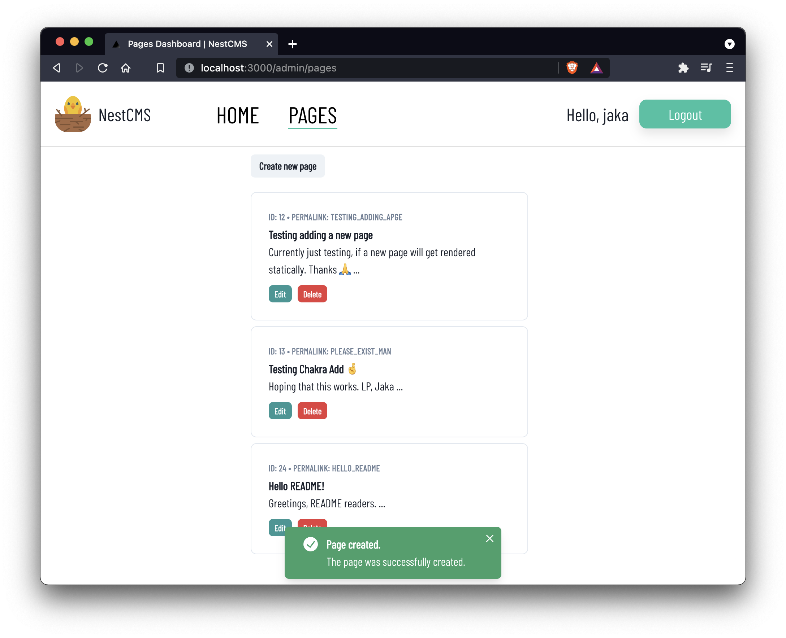

# NestCMS server

## NestCMS

This is the repository containing all of the backend code, necessary to run NestCMS. NestCMS is a simple content management system build with NestJS on the backend and React (Next.js) on the frontend.



This repository houses the backend code, to which the frontend code from the [Nest CMS client](https://github.com/jstavanja/NestCMSNextClient) connects to.

## Installation

```bash
$ npm install
```

## Running the app
Create a .env file, which houses the variables PORT and JWT_SECRET.

Example of the .env file:
```
PORT=8000
JWT_SECRET="ajwtsecret"
```

Of course, you should make your JWT secret more secure.

Once you've set up the environment variables, run the following commands.

```bash
# development
$ npm run start

# watch mode
$ npm run start:dev

# production mode
$ npm run start:prod
```

The database used will be SQLite.

## Test

To run the application's tests, run the following commands:

```bash
# unit tests
$ npm run test

# e2e tests
$ npm run test:e2e

# test coverage
$ npm run test:cov
```

## Stay in touch

- Author - [Jaka Stavanja](https://stavanja.xyz)
